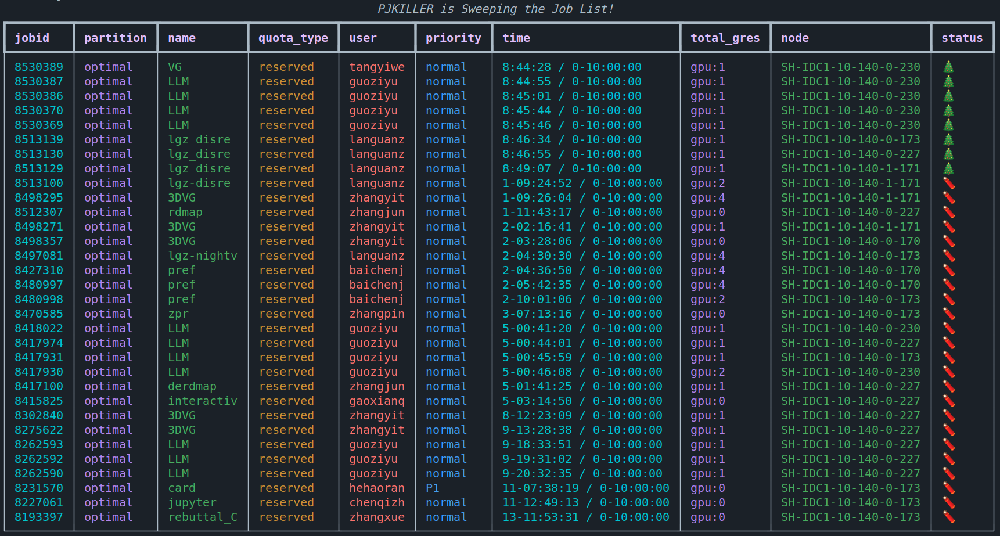

# Pj-Kill
A lightweight Tool for S-cluster to clean timeout jupyter jobs, which supports scheduler sweep, logging and rich CLI.

## Update
- [x] Add config feature, GPU limitation and enhance spot kill rule [2023-8-03]

### Examples

- A single RUN
```zsh
pjkill --unkill # unkill option gives a test w/o kill any jobs
```


- Sweep by scheduler
```zsh
pjkill --sweep # sweep every 60 minute
``` 

- All the logs are stored in `~/.pjkill/log` by default
```zsh
(base) tree ~/.pjkill/log -L 1
/mnt/petrelfs/qudelin/.pjkill
├── PJKILLER_20230906224448.log
├── PJKILLER_20230906224657.log
├── PJKILLER_20230906224659.log
├── PJKILLER_20230906225010.log
├── PJKILLER_20230906225040.log
├── PJKILLER_20230906225159.log
├── PJKILLER_20230906225932.log
├── PJKILLER_20230906230038.log
├── PJKILLER_20230906231724.log
└── PJKILLER_20230906231905.log
```

### Install

Requires python 3.6+, install the dependencies before lunching the tool.

```zsh
pip install -r requirements.txt
pip install git+https://github.com/DelinQu/pj-kill # install from remote repo
```


### Usage

```bash
usage: pjkill [-h] [--cfg CFG] [--sweep] [--unkill] [--version]

sweep all jobs on a partition and kill the timeout process.

optional arguments:
  -h, --help  show this help message and exit
  --cfg CFG   pjkill config file, $HOME/.pjkill/config.yaml
              by default
  --sweep     sweep around every cycle, False by default
  --unkill    unkill the job to stay safe False by default
  --version   display version and exit, False by default
```

- Configuration and log file are under $HOME/.pjkill by default:
```yaml
user: "$" # the user to query, all by default
partition: optimal # the partition to query, optimal by default
type: reserved # source type, [reserved, spot], reserved by default
cycle: 60 # pjkill run every cycle time in minute, 60 by default
timeout: 10 # timeout in hour, 10 by default
jp_ngpu: 2 # gpu limit of every job, 2 by default
total_ngpu: 12 # gpu limit of every user, 12 by default
njob: 2 # jupyter job number limit of every user, 2 by default
SUDO_PASSWD: 123456 # the passwd for sudo authorization

# capture by CMD
sweep: False # sweep around every cycle, False by default
unkill: False # unkill the job to stay safe False by default
version: False # display version and exit, False by default
```


### Rules

Jobs will be killed if:

- [x] Jobs exceed the timeout limitation

- [x] Jobs exceed the gpu number limitation

- [x] user exceed the job number limitation

### License

MIT License, see [LICENSE.txt](LICENSE.txt)

